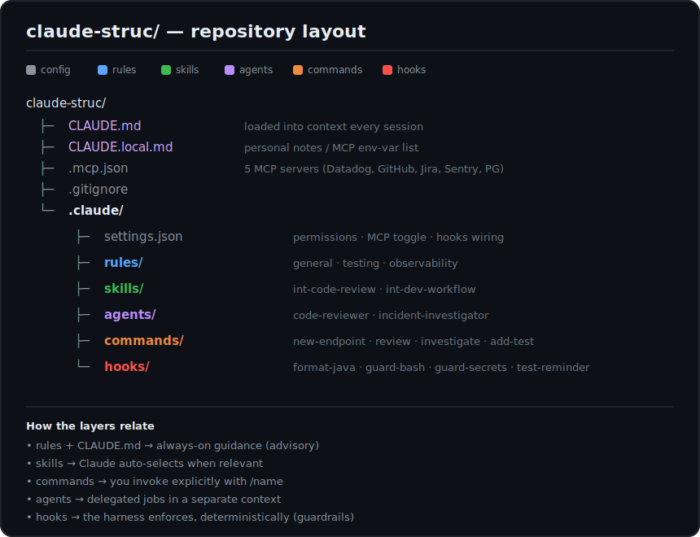
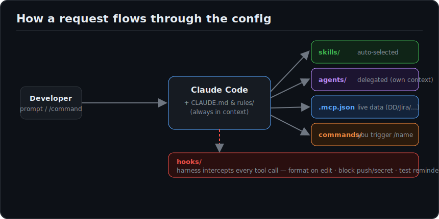

# claude-struc

[](https://github.com/nishantgautamIT/claude-struc/actions/workflows/validate.yml)

A ready-to-use **Claude Code** configuration scaffold for **Spring Boot microservices**
(Java 21, Spring Boot 3.x). Drop it into a service repo to give Claude Code shared
project context, guardrails, reusable workflows, and live access to your tooling
(Datadog, GitHub, Jira, Sentry, Postgres) via MCP.

> Everything here is plain Markdown + JSON + shell. No build step — Claude Code reads it directly.

---

## Folder structure



```text
claude-struc/
├─ CLAUDE.md            # Project guide — loaded into context every session
├─ CLAUDE.local.md      # Personal, machine-local notes (e.g. MCP env-var list)
├─ .mcp.json            # MCP servers: Datadog, GitHub, Atlassian, Sentry, Postgres
├─ .gitignore
└─ .claude/
   ├─ settings.json     # Permissions + MCP toggle + hooks wiring (shared, committed)
   ├─ rules/            # Always-on guidance, referenced from CLAUDE.md
   │  ├─ general.md
   │  ├─ testing.md
   │  └─ observability.md
   ├─ skills/           # Capabilities Claude auto-selects when relevant
   │  ├─ int-code-review/SKILL.md
   │  └─ int-dev-workflow/SKILL.md
   ├─ agents/           # Subagents — delegated jobs that run in a separate context
   │  ├─ code-reviewer.md
   │  └─ incident-investigator.md
   ├─ commands/         # Slash commands you invoke explicitly with /name
   │  ├─ new-endpoint.md
   │  ├─ review.md
   │  ├─ investigate.md
   │  └─ add-test.md
   └─ hooks/            # Shell scripts the harness runs automatically (guardrails)
      ├─ format-java.sh
      ├─ guard-bash.sh
      ├─ guard-secrets.sh
      └─ test-reminder.sh
```

---

## How the pieces fit together



| Layer | Lives in | Triggered by | Runs in | Purpose |
|-------|----------|--------------|---------|---------|
| **Memory / rules** | `CLAUDE.md`, `.claude/rules/` | always loaded | main convo | Standing conventions Claude must follow |
| **Skills** | `.claude/skills/` | Claude auto-selects | main convo | Reusable knowledge/procedures |
| **Commands** | `.claude/commands/` | you type `/name` | main convo | Repeatable prompts you fire on demand |
| **Subagents** | `.claude/agents/` | Claude/you delegate | separate context | Focused jobs (review, incident triage) |
| **Hooks** | `.claude/hooks/` + `settings.json` | lifecycle events | the harness | Deterministic guardrails & automation |
| **MCP** | `.mcp.json` | tool calls | external servers | Live data: Datadog, GitHub, Jira, Sentry, DB |

The key distinction: **rules and skills are advisory** (the model chooses to follow them),
while **hooks are enforced** by the harness on every matching tool call — so things like
"never push without asking" and "auto-format Java" happen deterministically.

---

## What's inside

### `CLAUDE.md` + `rules/`
Loaded into context on every session. Keep `CLAUDE.md` short and high-signal; detailed
rules live in `.claude/rules/*.md` and are pulled in via `@`-references:

- **general.md** — layering (`controller → service → repository`), constructor injection,
  DTOs over the wire, central exception handling, no secret logging.
- **testing.md** — JUnit 5 + Mockito, `@WebMvcTest`, Testcontainers for real Postgres,
  deterministic tests.
- **observability.md** — Datadog structured logging, trace propagation, Micrometer metrics,
  log-level discipline.

### `skills/`
Capabilities Claude selects automatically when the task matches the skill's description.

- **int-code-review** — Spring Boot review checklist.
- **int-dev-workflow** — branch → build → test → PR flow.

### `agents/` (subagents)
Delegated jobs that run in their own context window and return a result.

- **code-reviewer** — reviews a diff against the repo rules; tools limited to read/search.
- **incident-investigator** — pulls live Datadog + Sentry telemetry and correlates with code.

### `commands/` (slash commands)
Prompt templates you invoke explicitly.

| Command | Does |
|---------|------|
| `/new-endpoint <resource> <verb>` | Scaffold controller + service + DTO + tests |
| `/review [PR/files]` | Run the diff through the `code-reviewer` subagent |
| `/investigate <symptom>` | Triage an alert via the `incident-investigator` subagent |
| `/add-test <Class>` | Generate JUnit5/Mockito/Testcontainers tests |

### `hooks/`
Wired in `settings.json`; the harness runs them on lifecycle events.

| Hook | Event | Behavior |
|------|-------|----------|
| `format-java.sh` | PostToolUse (Edit/Write) | Spotless-format edited `.java` files |
| `guard-bash.sh` | PreToolUse (Bash) | Block `git push` / `mvn deploy` / `gradle publish` |
| `guard-secrets.sh` | PreToolUse (Edit/Write) | Block writes to `.env`, `application-*.yml`, `secrets/` |
| `test-reminder.sh` | Stop | Remind to run tests when Java files changed |

### `.mcp.json` (MCP servers)
Gives Claude live access to your tooling. All values use `${ENV_VAR}` placeholders —
**no secrets are committed**.

| Server | Use |
|--------|-----|
| **datadog** | APM, logs, metrics for incident investigation |
| **github** | PRs, issues, code search |
| **atlassian** | Jira / Confluence (OAuth) |
| **sentry** | Error tracking (OAuth) |
| **postgres** | Inspect the service database |

---

## Setup

1. **Copy** `.claude/`, `CLAUDE.md`, and `.mcp.json` into your service repo
   (or use this repo as a GitHub **template**).
2. **Edit `CLAUDE.md`** — set the service name and any service-specific conventions
   (build tool is Maven; swap the commands if your service uses Gradle).
3. **Export MCP env vars** (see `CLAUDE.local.md`):
   ```sh
   export DATADOG_API_KEY="..."   DATADOG_APP_KEY="..."
   export GITHUB_TOKEN="..."      DATABASE_URL="postgresql://..."
   ```
   Atlassian and Sentry authenticate via OAuth on first use (`/mcp`).
4. **Verify** the Datadog MCP URL/auth for your Datadog site (eu1/us3/us5) — endpoints vary.
5. Open the repo in Claude Code. Type `/` to see the commands; rules and skills load automatically.

---

## Conventions enforced

- `controller → service → repository`; thin controllers, logic in `@Service`.
- Constructor injection only — no field `@Autowired`.
- DTOs over the API, never JPA entities.
- Request validation with `jakarta.validation`; central `@RestControllerAdvice`.
- Structured logging for Datadog; never log secrets/PII.
- A test for every behavior change.

---

## Install as a plugin (experimental)

Instead of copying files per repo, this repo also ships a plugin marketplace manifest so
teammates can install the skills, agents, and commands org-wide from one source:

```
/plugin marketplace add nishantgautamIT/claude-struc
/plugin install spring-boot-claude-kit
```

> ⚠️ **Needs testing.** The plugin manifests in `.claude-plugin/` are a starting point.
> **Hooks are not distributed via the plugin** — they're wired in `settings.json`, whereas
> plugins expect a `hooks/hooks.json`. Verify command/agent/skill discovery after install and
> migrate the hooks separately if you want them shipped through the plugin.

## Notes

- `CLAUDE.local.md` and `.claude/settings.local.json` are intended as personal/local files.
  Re-add them to `.gitignore` if you don't want them shared.
- CI (`.github/workflows/validate.yml`) validates JSON, shellchecks the hooks, and checks
  skill/agent frontmatter on every PR.
